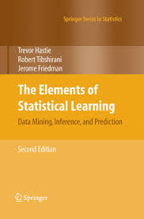
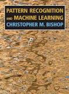
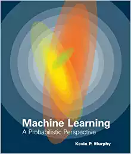
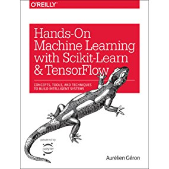

# books_for_ML

A curated list of books for ML basics, ML trainings (with Python and R) and ML advanced topics (deep learning, NLP)

## Fundamentals

### The Elements of Statistical Learning: Data Mining, Inference, and Prediction, by T. Hastie, R. Tibshirani, J. Friedman 

Summary : Bible for Statistical Learning

Available [here](https://web.stanford.edu/~hastie/Papers/) for free (pdf version).

Hardcover available [here](https://www.amazon.fr/Elements-Statistical-Learning-Inference-Prediction/dp/0387848576)

### Pattern Recognition and Machine Learning, by Kevin Bishop

Available [here](http://users.isr.ist.utl.pt/~wurmd/Livros/school/) for free (pdf version).

Hardcover available [here](https://www.amazon.fr/Pattern-Recognition-Machine-Learning-Christopher/dp/0387310738)

### Introduction to Statistical Learning (with Application in R) by G. James, D. Witten, T. Hastie and R. Tibshirani

Available [here](http://www-bcf.usc.edu/~gareth/ISL/) for free (pdf version).

Hardcover available [here](https://www.amazon.com/Introduction-Statistical-Learning-Applications-Statistics/dp/1461471370)

### Machine Learning : A probabilistic perspective by Kevin Murphy

Some excerpts available [here](https://www.cs.ubc.ca/~murphyk/MLbook/)

Hardcover available [here](https://www.amazon.com/Machine-Learning-Probabilistic-Perspective-Computation/dp/0262018020/ref=sr_1_2?ie=UTF8&qid=1336857747&sr=8-2) 

## ML with Python

### Hands-On Machine Learning with Scikit-Learn and TensorFlow: Concepts, Tools, and Techniques to Build Intelligent Systems by Aurélien Géron

 
Hardcover available [here](https://www.amazon.com/_/dp/1491962291?tag=oreilly20-20)

### Python Data Structures and Algorithms: Improve application performance with graphs, stacks, and queues

Hardcover available [here](https://www.amazon.com/Python-Data-Structures-Algorithms-application/dp/1786467356)